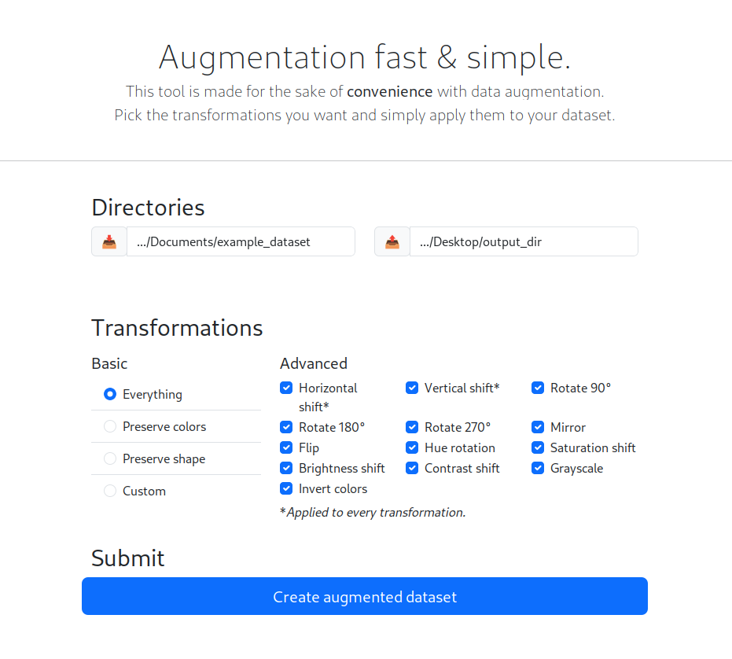
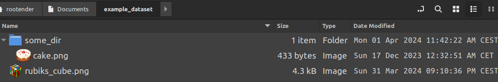
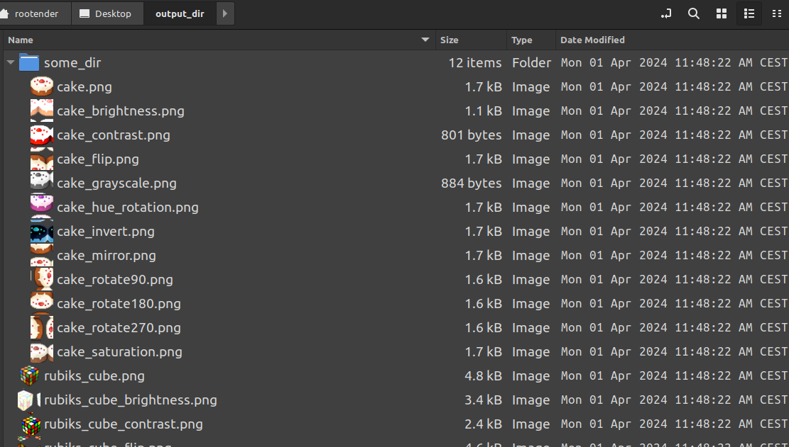

# Augmentator

Augmentator is a ready-to-use tool for augmenting image datasets. With just a few clicks you could increase the size of your dataset without sacrificing its quality.

> You choose your transformations, augmentator does the rest.

### Motivation

There are several tools for augmenting data, but most of them are libraries that need to be implemented. This tool was made to avoid this hassle and that's why it's ready-to-use.

## Showcase

The design is very direct. Set the input directory and a place where you want to have the output. Select desired transformations and run the augmentation. Simple as that.

### Example

Here is a simple dataset. 2 images inside and one is inside a directory. 

### Result

Hey, the tool has augmented all of the images and kept the directories structure! Even the images with modifications have added suffix that explains what happened. Nice...

## Installation

The binaries could be found under the [releases](https://github.com/RooTender/augmentator/releases/) section. Those are made for Linux, MacOS and Windows. Pick the one you need and you're ready to go.

## Contributing & help

If you have a cool idea or you've noticed a bug, feel free to contribute through `issues` tab. I want to keep it small and simple though, but I'm open for slight improvements 🙂.
